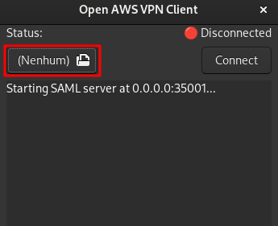

**Disclaimer**: This is an unofficial implementation of an AWS VPN Client for Linux. It does not have any relation with AWS in any way.

## Open AWS VPN Client

This is an unofficial AWS VPN Client for Linux based on the reverse engineering and study made by [samm-git/aws-vpn-client](https://github.com/samm-git/aws-vpn-client) and published in [their blog](https://smallhacks.wordpress.com/2020/07/08/aws-client-vpn-internals/).

All credits on how the implementation works goes for [samm-git](https://github.com/samm-git/aws-vpn-client), we only have created a user-friendly GUI and rewrote the server and shell script into Rust.

**This client is only for SAML based authentication VPN connections. Distros already support regular VPN connections through `openvpn`.**

## How to use

### Connecting

First open the GUI and select your AWS `.ovpn` file by clicking in the highlighted area.

Then click on the **Connect** button.

The regular connection flow will start, login into the AWS account. If the authentication succeeds, you will be redirected to a local address that loads the authentication credentials.

After the credentials are loaded, the OpenVPN command will be executed, this requires root privileges, so `pkexec` is used to launch OpenVPN, which will prompt for your root password.

### Disconnecting

Clicking on the **Disconnect** button or closing the GUI, will disconnect the VPN, it does require root privileges as well (and `pkexec` is used) to kill the OpenVPN process.

If the openaws-vpn-client crashes, the VPN connection will not be closed, but in the next time you open the GUI, you will be asked to kill old OpenVPN process.

CTRL+C and SIGTERM are not affected by this, they will always kill the OpenVPN process.

I'll be working on a better solution soon.

## Installation

Currently, we do not have installation scripts, but you can easily download artifacts from [GitLab](https://gitlab.com/Kores/openaws-vpn-client/-/packages).

## Building

AWS VPN needs a custom `openvpn` client, happily (because of OpenVPN GPL License implications) this client is open-source and [Alex Samorukov/samm](http://samm.kiev.ua/) created patch files based on this client source code, so we can easily apply those patches and build a custom OpenVPN client.

### Building custom OpenVPN client

A build script is provided in `scripts/patch-openvpn.sh`, this script downloads OpenVPN source code from official OpenVPN website and the patch files from [Alex Samorukov GitHub](https://github.com/samm-git/aws-vpn-client), then it applies the patches and builds the client, copying licenses and binaries into `share/openvpn`.

### Building openaws-vpn-client

A nightly rust toolchain is required to build openaws-vpn-client, you can use `rustup` to install it, then run `cargo +nightly build`.

#### Requirements

You need to have **gtk3**, **glib** and **cairo** installed in the system in order to build **openaws-vpn-client**, other libraries may be needed such as glibc, since the client relies on some libc functions.

At the moment, we do not provide musl based binaries, but we have an initial work in `musl/Dockerfile`, it compiles, but do not launch yet.

## Why I started this project

Amazon already provides an official VPN Client for Linux, the problem is:

- It uses Mono, so not completely native
- It is not available for all Linux distributions
  - Seems to work only on .deb distros
  - There is alternatives available on other distros, but sometimes they are broken¹.
- It's closed source, so I could not simply do a PR to fix the problems in other distros

I'm using Arch Linux, I tried AUR version of official client, the recent version wasn't working, so I download an older one, it opened but didn't work, wasn't able to connect to the VPN with a generic error.

So I looked for hours for a solution, and ended up finding an alternative client developed by [samm-git/aws-vpn-client](https://github.com/samm-git/aws-vpn-client) in bash, based on a reverse engineering study posted in [their blog](https://smallhacks.wordpress.com/2020/07/08/aws-client-vpn-internals/) from 2020. 
This script wasn't working, but it got more far than the official client on Arch, and was open-source and easy to debug, tweak and test, after a couple of hours, I was able to get the script working, so I decided to create a user-friendly open-source GUI based on the study and the original script.

So, thanks [samm-git](https://github.com/samm-git/aws-vpn-client) for taking their time to study and write a wrapper, that solved my problem.

## Messy code

The code was entirely written from the ground in Rust, but it's in a very messy state, and very based on Reference-Counting, not taking advantage of Rust's ownership system, this approach was used mainly because GTK itself is Reference-Counting based, so it was easier to write that way.

Also, GTK is not a Rust framework, so it is very hard to write multi-thread GUI applications, and I needed to start an HTTP Server, and Tokio is normally used for this, also I needed to start some processes in background, this ended-up in needing to implement `Send + Sync` for a bunch of structs, and there was some refactoring in between, so there is some structs that implements `Send + Sync` but does not need to be marked, others just has a bad implementation.

There is a lot of `unwrap()` calls which may panic, if they do, the application just crashes, I will be working on improving the code once I get some time, but for now, it works, and solves my problem, and I published this project so this can help others too.

### Stack

- GTK3
- Warp
- Tokio
